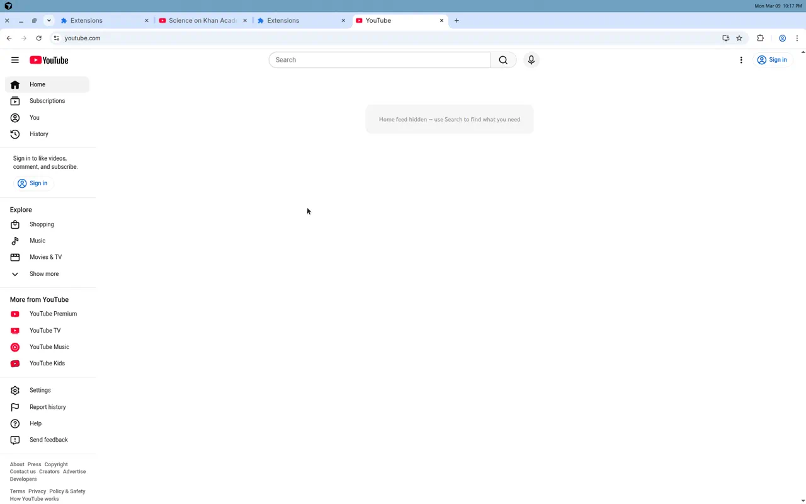
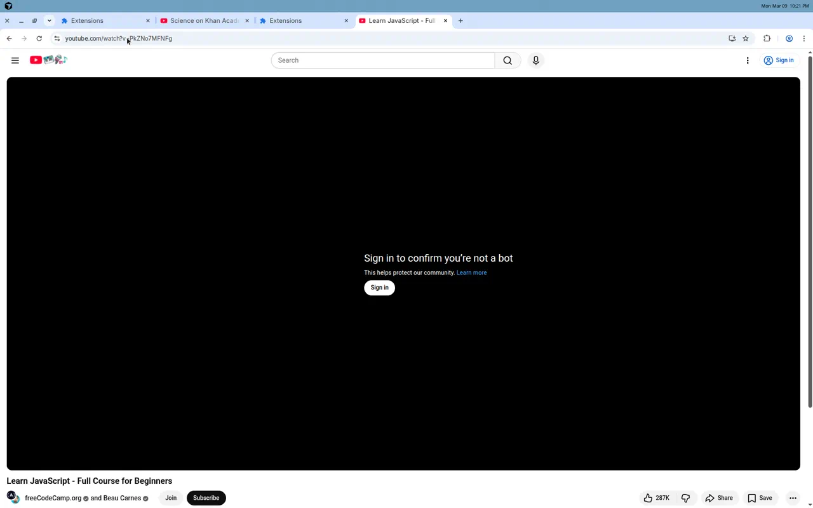
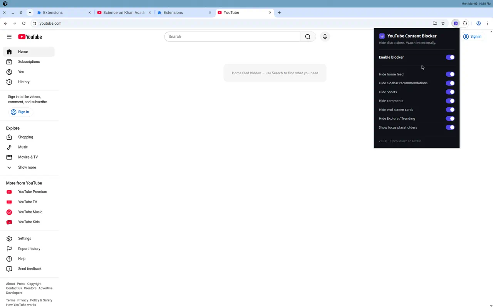

# YouTube Content Blocker

A lightweight Chrome extension that hides the most distracting parts of YouTube so you can watch intentionally instead of getting pulled into recommendation loops.

> **One-liner:** Remove recommendations, Shorts, comments, and other distraction surfaces from YouTube — keep search and intentional watching intact.

## What It Blocks

| Surface | Default |
|---------|---------|
| Home feed / recommendations | Hidden |
| Watch-page sidebar suggestions | Hidden |
| Shorts (shelves, nav, page) | Hidden |
| Comments | Hidden |
| End-screen cards & overlays | Hidden |
| Explore / Trending | Hidden |

Every feature can be toggled individually from the extension popup.

## Install

### From Chrome Web Store

*Coming soon.*

### Manual Install (Developer Mode)

1. Download or clone this repository
2. Open `chrome://extensions` in Chrome
3. Enable **Developer mode** (top-right toggle)
4. Click **Load unpacked**
5. Select the project folder
6. Open YouTube — distractions are hidden immediately

## How It Works

- **No backend.** Everything runs locally in your browser.
- **No data collection.** Settings are saved via Chrome's sync storage so they follow your Chrome profile.
- **Manifest V3.** Built on the latest Chrome extension platform.
- **Plain JavaScript + CSS.** Zero dependencies, fast, and lightweight.

The extension applies CSS class flags to the page and uses a `MutationObserver` to handle YouTube's SPA navigation without requiring page refreshes.

## Screenshots

| Home (hidden) | Watch page (clean) | Popup |
|:---:|:---:|:---:|
|  |  |  |

## Packaging

```bash
bash scripts/package-extension.sh
```

Creates `dist/youtube-content-blocker.zip` ready for Chrome Web Store upload or GitHub release.

## Privacy

YouTube Content Blocker does **not** collect, store, or transmit any personal data. It only saves your toggle preferences locally through Chrome's built-in storage API. No analytics, no tracking, no network requests.

See [PRIVACY.md](PRIVACY.md) for the full privacy statement.

## Tech Stack

- Chrome Extension Manifest V3
- Plain JavaScript (no framework)
- Plain CSS
- No backend, no build step, no dependencies

## Contributing

Found a broken selector or YouTube UI change? PRs are welcome.

1. Fork the repo
2. Create a feature branch
3. Test locally in Chrome
4. Submit a pull request

## License

MIT
